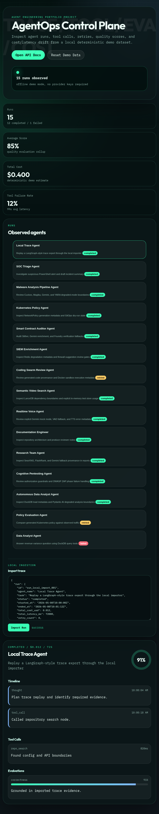
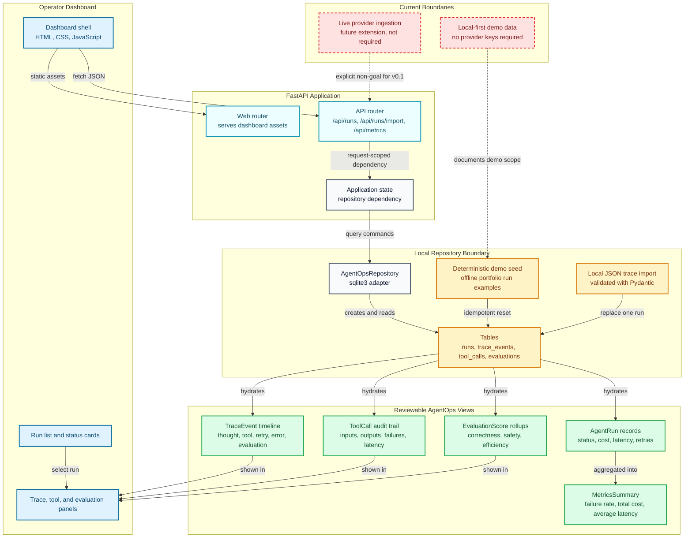

# AgentOps Control Plane

Local-first control plane for inspecting AI agent runs, trace timelines, tool calls, evaluation scores, retries, and cost/latency metrics.

This project is built as a portfolio-grade AI engineering system: it shows how agentic software can expose operational state without needing paid model APIs for the demo path.



## Portfolio Review

- [Architecture guide](docs/ARCHITECTURE.md) explains the service boundaries, database model, and dashboard data flow.
- [Demo guide](docs/DEMO.md) gives a safe local walkthrough with deterministic seeded data.
- The screenshot above is generated from the real local dashboard served by this repository.

## What Works Today

- FastAPI backend with typed API responses.
- SQLite repository seeded with deterministic demo agent runs.
- Portfolio demo data covering the broader AI/security/data project set.
- Run detail API with trace events, tool calls, and evaluation scores.
- Local JSON trace import endpoint for replaying LangGraph/OpenAI-style exported runs.
- Metrics API for cost, latency, failure-rate, and quality-score rollups.
- Browser dashboard for run inspection, trace review, tool failures, and evaluation rollups.
- CI with Ruff, formatting, compile checks, pytest, and coverage.

## Architecture



## Quick Start

```bash
uv sync --extra dev
uv run uvicorn agentops_control_plane.main:app --reload
```

Open `http://127.0.0.1:8000` for the dashboard or `http://127.0.0.1:8000/docs` to inspect the API.

## API Surface

- `GET /api/health`
- `GET /api/runs`
- `GET /api/runs/{run_id}`
- `GET /api/metrics/summary`
- `POST /api/runs/import`
- `POST /api/demo/reset`

## Local Trace Import

Use `POST /api/runs/import` to replay one exported agent run into the local SQLite store. Child trace, tool, and evaluation rows inherit the imported `run.id`, so a single JSON document becomes one reviewable dashboard run.

```json
{
  "run": {
    "id": "run_langgraph_import_001",
    "agent_name": "LangGraph Import Agent",
    "task": "Replay a real trace export through the AgentOps importer",
    "status": "completed",
    "started_at": "2026-05-08T10:00:00Z",
    "ended_at": "2026-05-08T10:01:12Z",
    "total_cost_usd": 0.012,
    "total_latency_ms": 72000,
    "retry_count": 0,
    "error_count": 0,
    "score": 0.91
  },
  "trace": [
    {
      "id": "trace_langgraph_001",
      "timestamp": "2026-05-08T10:00:04Z",
      "event_type": "tool_call",
      "message": "Called repository search node",
      "metadata": {"framework": "langgraph", "node": "research"}
    }
  ],
  "tool_calls": [],
  "evaluations": []
}
```

## Current Limits

- Demo data is deterministic and local-only.
- No real provider keys are required or used.
- The import endpoint accepts local trace JSON but does not subscribe to live provider webhooks yet.
- SQLite is intentionally used for a lightweight demo path; production deployments would need migrations, auth, and multi-tenant storage controls.
