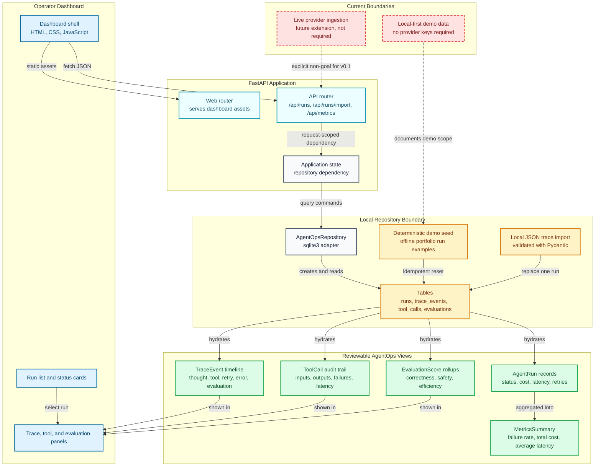

# Architecture

AgentOps Control Plane is a local-first observability surface for agentic systems. The current implementation is intentionally small: a FastAPI app, a SQLite repository, deterministic demo data, and a browser dashboard that renders API responses directly.

## System Diagram

## Main Components

- `src/agentops_control_plane/main.py` builds the FastAPI app, seeds the local repository, mounts static assets, and includes the API and web routers.
- `src/agentops_control_plane/api.py` defines the typed HTTP surface for health, runs, run detail, metrics, local trace import, and demo reset.
- `src/agentops_control_plane/repository.py` owns SQLite schema creation, deterministic seeding, JSON metadata storage, and model hydration.
- `src/agentops_control_plane/models.py` defines the run, trace, tool-call, evaluation, metrics, and detail response contracts.
- `src/agentops_control_plane/web_assets/` contains the browser dashboard that fetches JSON from the API and renders the operator view.

## Data Flow

1. `create_app()` builds an `AgentOpsRepository` from `Settings` and stores it on `app.state`.
2. `ensure_seeded()` loads deterministic agent runs when the local SQLite database is empty.
3. The dashboard loads `/api/metrics/summary` and `/api/runs` on page start.
4. Selecting a run loads `/api/runs/{run_id}` and renders the trace timeline, tool calls, and evaluation bars.
5. `POST /api/runs/import` validates one local JSON trace, attaches the run id to child rows, and replaces that run transactionally in SQLite.
6. `POST /api/demo/reset` clears and reseeds the local database so the demo can be restored during interviews.

## Local Import Boundary

The import endpoint is designed for local trace exports from agent frameworks. It accepts one run plus optional trace events, tool calls, and evaluation scores. This gives reviewers a realistic extension point without introducing provider SDKs, queues, background workers, or paid APIs.

Imported runs are stored with the same `AgentRun`, `TraceEvent`, `ToolCall`, and `EvaluationScore` models used by seeded demo data, so they immediately appear in the dashboard and metrics rollups.

## Review Boundaries

- The current repo is a local observability demo. It can import local JSON trace exports, but it does not subscribe to live OpenAI, Anthropic, LangGraph, or CrewAI provider webhooks yet.
- No model provider key is required for the seeded demo path.
- SQLite keeps setup simple for portfolio review. A production service would add auth, migrations, background ingestion, tenant isolation, and retention policies.
- The dashboard is intentionally dependency-light: static HTML, CSS, and JavaScript served by FastAPI.
